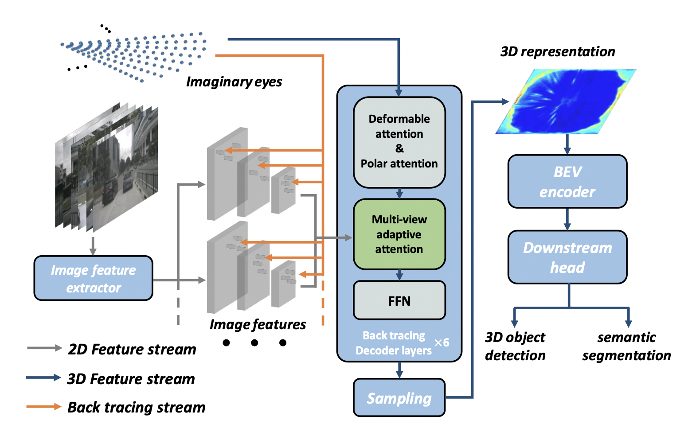

# Learning Ego 3D Representation as Ray Tracing
### [Website](https://fudan-zvg.github.io/Ego3RT) | [Paper](https://arxiv.org/abs/2206.04042)
> [**Learning Ego 3D Representation as Ray Tracing**](https://arxiv.org/abs/2206.04042),            
> Jiachen Lu, Zheyuan Zhou, Xiatian Zhu, Hang Xu, Li Zhang        
> **ECCV 2022**

## Demo


## News
- [2022/07/05]: First version of Ego3RT is released! Code for detection head and training configs will comming soon.
- [2022/07/04]: Ego3RT is accepted by **ECCV 2022**!

## Abstract
A self-driving perception model aims to extract 3D semantic representations from multiple cameras collectively into the bird's-eye-view (BEV) coordinate frame of the ego car in order to ground downstream planner. Existing perception methods often rely on error-prone depth estimation of the whole scene or learning sparse virtual 3D representations without the target geometry structure, both of which remain limited in performance and/or capability. In this paper, we present a novel end-to-end architecture for ego 3D representation learning from an arbitrary number of unconstrained camera views. Inspired by the ray tracing principle, we design a polarized grid of ``imaginary eyes" as the learnable ego 3D representation and formulate the learning process with the adaptive attention mechanism in conjunction with the 3D-to-2D projection. Critically, this formulation allows extracting rich 3D representation from 2D images without any depth supervision, and with the built-in geometry structure consistent w.r.t. BEV. Despite its simplicity and versatility, extensive experiments on standard BEV visual tasks (e.g., camera-based 3D object detection and BEV segmentation) show that our model outperforms all state-of-the-art alternatives significantly, with an extra advantage in computational efficiency from multi-task learning.

## Methods


## Train & Test
Please refer to the [get_started.md](get_started.md)

## Result
### **3D object detection on nuScenes validation set**
|        Model         | mAP  | NDS  |
| :------------------: | :--: | :---: |
|[Ego3RT, ResNet101_DCN](projects/configs/ego3rt/ego3rt_polar80x256_cart160x160.py) | 37.5 | 45.0 |
|Ego3RT, VoVNet | 47.8 | 53.4|

### **3D object detection on nuScenes test set**
|        Model         | mAP  | NDS  |
| :------------------: | :--: | :---: |
|[Ego3RT, ResNet101_DCN](projects/configs/ego3rt/ego3rt_polar80x256_cart160x160.py) | 38.9 | 44.3 |
|Ego3RT, VoVNet | 42.5 | 47.3|


### **BEV segmentation on nuScenes validation set**
|        Model         | Multitask | mIoU |
| :------------------: | :--: | :--: |
|Ego3RT, EfficientNet | no | 55.5|
|Ego3RT, ResNet101_DCN | yes | 46.2|

## License

[MIT](LICENSE)
## Reference

```bibtex
@inproceedings{lu2022ego3rt,
  title={Learning Ego 3D Representation as Ray Tracing},
  author={Lu, Jiachen and Zhou, Zheyuan and Zhu, Xiatian and Xu, Hang and Zhang, Li},
  booktitle={European Conference on Computer Vision},
  year={2022}
}
```
## Acknowledgement

Thanks to previous open-sourced repo: 
[MMDetection3D](https://github.com/open-mmlab/mmdetection3d)
[DETR3D](https://github.com/WangYueFt/detr3d)
[Deformable DETR](https://github.com/fundamentalvision/Deformable-DETR)